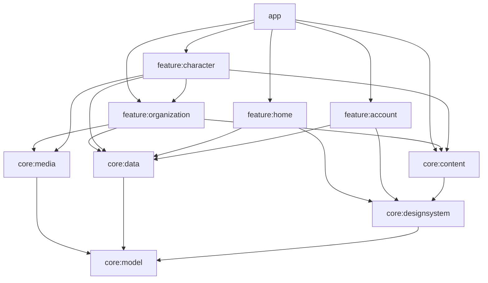

# 模块与维护

## 依赖方向

`app` 负责宿主、导航、Android 生命周期和跨模块页面装配。`core:model` 是纯 Kotlin，保存实体身份、领域模型、日期与链接规则。Retrofit DTO 在 `core:data` 结束，不传入 Compose。`core:content` 只暴露原生内容块和渲染器，不暴露 CommonMark 节点给业务。

当前实际创建 10 个 Gradle 模块，未为尚未开始的业务创建空工程。测试就近存放在模块的 test/androidTest，尚没有值得单独提取的 core:testing；以后多个模块出现重复测试设施时再提取。

## 状态与生命周期

- UI 只展示状态、发出事件；ViewModel 持有协程与页面状态，DataStore/Room 保存需要跨进程保留的数据。
- HomeUiState 内每块有独立 LoadState。页面重试不会把已有内容全部清空；正在刷新的内容保持可操作。
- 页面返回栈用可序列化 NavKey，五个根栈分别记忆；宿主有 SaveableStateHolder，Reader 的 ViewModel 由导航项生命周期管理。
- 前台首页才运行分钟时钟。数据请求随协程取消，后台没有定时同步服务、音乐服务或常驻通知。
- 密码只存在登录页面临时状态，旋转/重建后清空。登录窗口 FLAG_SECURE，退出该页立即清除标志。
- 正文解析在 Default 线程，网络/数据库在 IO 线程；阅读进度停止滚动 500 ms 后写入，离开页面补记末次位置。

## 网络与存储

公共 API 并发最多 4，OkHttp 全局 8、每主机 4；单次连接 10 秒、读取 20 秒、整次调用 30 秒。只有幂等 GET 对网络中断、429 和 5xx 最多重试两次。TLS 错误、401/403、解析业务失败不当作瞬态错误反复请求。登录总流程 60 秒、PoW 12 秒且可取消。

JSON 与图片共用连接池，但令牌只在账号服务方法的明确参数中传入。禁止全局 Authorization 拦截器。重定向限制见 API 差异文档；新外链不能直接拼写入端点。

| 数据 | 策略 |
| --- | --- |
| 首页资讯/文章/公告列表 | 15 分钟 TTL |
| 卡池/活动/总力战 | 5 分钟 TTL |
| 角色简要与正文详情 | 24 小时 TTL |
| 生日 ID | 1 小时 TTL |
| 史书选读 | 6 小时 TTL，日期区间参与缓存键 |
| 幸运物 | 15 分钟，跨北京时间午夜重新校验 |
| 公共 JSON 缓存 | Room public_cache，最多约 64 MiB 内容，单条超过 2 MiB 不落库，按旧记录批量逐出 |
| 图片 | Coil 内存上限目标为可用应用堆的 18%，磁盘 256 MiB，按控件尺寸解码 |
| 收藏/足迹 | 独立表；实体类型+ID 为主键；足迹最近 100 条；不随公共缓存逐出 |
| 账号 | Android Keystore AES-256-GCM，刷新令牌与账号摘要存于 noBackupFilesDir 的 AtomicFile；访问令牌仅内存 |

TTL 表示下次观察/刷新时判断新鲜度，不是后台保证更新频率。公共 JSON 的 64 MiB 是内容预算，不包含 SQLite 页和 WAL 的临时开销。图片与 JSON 清理后正在运行的请求仍可能填充少量新缓存。

Room 数据库 v1 的 schema 已导出至 core/data/schemas。升级字段时添加 Migration 并测试旧库迁移；**禁止 fallbackToDestructiveMigration**。收藏与足迹目前为本机数据，账号切换不会删除或上传。

## 接入下一模块

1. 先复核对应网站页面和 API 文档，用本次具体需求写该模块规格、非目标及验收条件。
2. 在 core:model 定义与框架无关的实体和状态；在 core:data 添加有界查询、映射、缓存及契约测试。
3. 创建 feature 模块，复用主题、图片、错误提示、链接和阅读组件；不要另建网络客户端、主题或令牌存储。
4. 在 app 增加可序列化目标，把当前 Portal 替换为真实模块入口；保留既有根导航和设备返回行为。
5. 只为关键风险补测试，运行基础门槛和受影响设备用例。更新本目录、原方案实施同步、接口差异及交接。

## 当前技术债与限制

复杂 HTML 中的内联样式、连续文字与图片顺序、嵌套列表视觉层级及全站自定义 Markdown 方言尚未完整覆盖。Reader 段落索引是当前正文结构下的阅读进度，正文大改后会钳制到有效索引，不提供跨版本语义定位。

0.3.0 在独立 core:media 中引入 Spine / Filament / Media3，生命周期、资源预算、取消与缓存由该层管理；角色页仅在用户开启预览时创建场景。QQ 频道仍为此前单独批准的 WebView。详见 [F2](模块/F2-角色图鉴与档案.md)。

## 0.2.0 接入补充

新增 Search / Community 目的地和独立学生根页面。认证文章只通过 AccountRepository.readArticle 读取，不进入 ContentRepository 公共缓存。搜索不持久化查询；社区公开快照的来源日期写在 CommunityContent.kt。具体行为及测试见 [19 实施同步](../../App项目文档/19-系统体验迭代实施同步.md)。

## 0.3.0 接入补充

角色列表普通查询 TTL 1 小时；有搜索词的查询只驻留内存。角色完整详情继续使用公共资料缓存，表态选中状态和补充草稿不进入公共缓存。资源缓存目标 512 MiB，downloads 按单文件、骨架／模型按完整依赖包淘汰。当前预览包受保护；单包下载上限 192 MiB，单文件 96 MiB，纹理与解包预算另行检查。

完整映射、资源契约和生命周期见 [20](../../App项目文档/20-角色图鉴与角色档案实施同步.md) 与 [ADR-024](决策/ADR-024-角色档案与原生媒体.md)。
